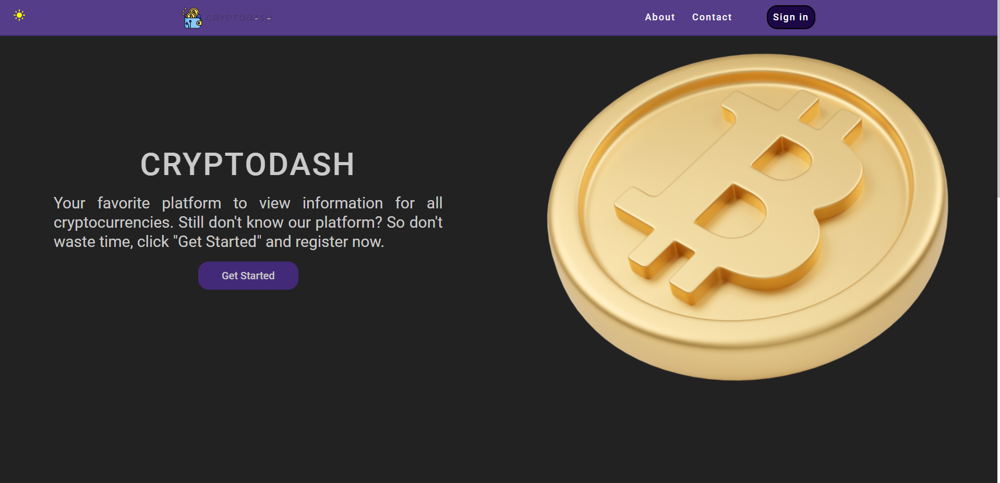
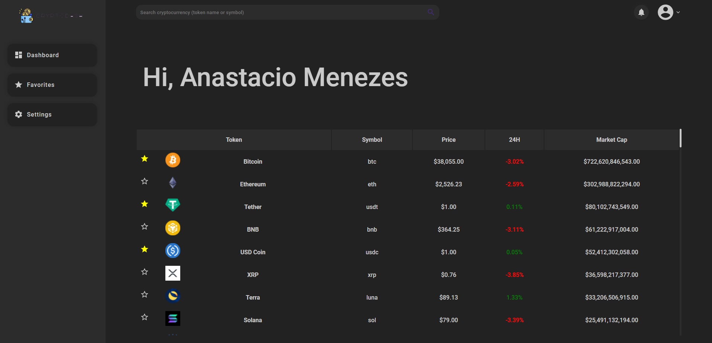
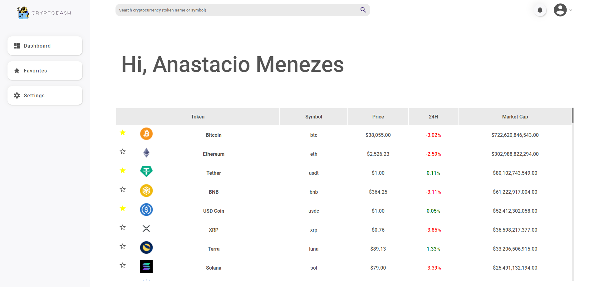
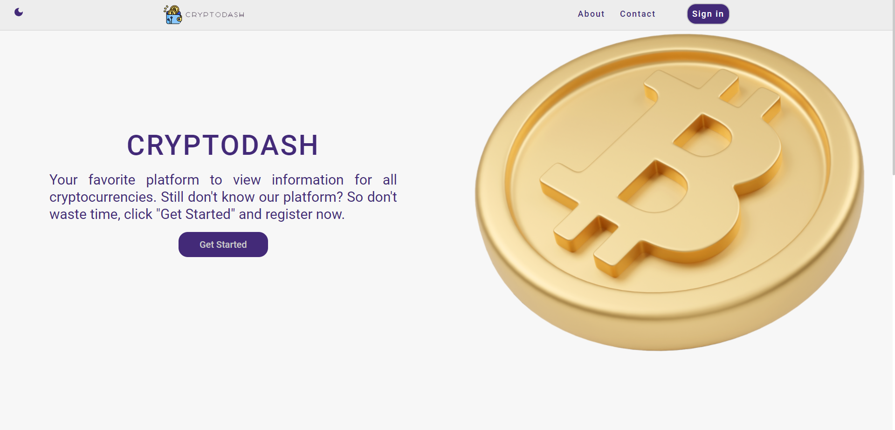
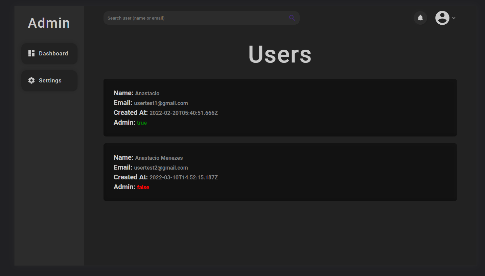
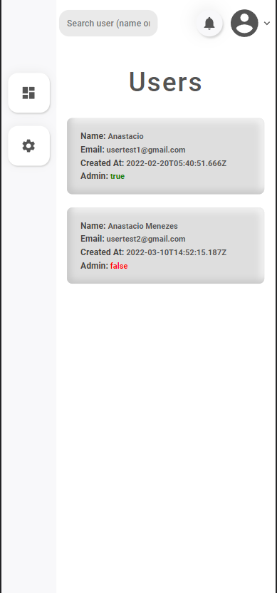

# CryptoDash

### Project developed in React with Redux and Styled-Components, fully responsive and using my own backend made in NodeJs: https://github.com/anastaciom/backend-project-cryptocurrencies.

---

## Deploy link: .........

## About the project:

### It is a system that will show you the quotes of all cryptocurrencies.

### Dark mode:

##  

### Light mode : 

---

## Admin dashboard:

- ### Desktop:

  

  ***

- ### Mobile:
  

---

## Preview:

---

## Dependencies :

- **@emotion/react**
- **@emotion/styled**
- **@mui/icons-material**
- **@mui/material**
- **axios**
- **react-redux**
- **react-router-dom**
- **react-spinners**
- **react-switch**
- **redux**
- **redux-thunk**

---

## DevDependencies:

- **styled-components**

---

## Git Clone:

### First run the command to clone the project on your machine:

    git clone  https://github.com/anastaciom/frontend-project-cryptocurrencies.git

### Enter the project folder:

    cd frontend-project-cryptocurrencies

### Inside the "frontend-project-cryptocurrencies" folder, install all dependencies by running:

    npm install

### Now, to run the project:

    npm run start

### will run at http://localhost:3000/

---
